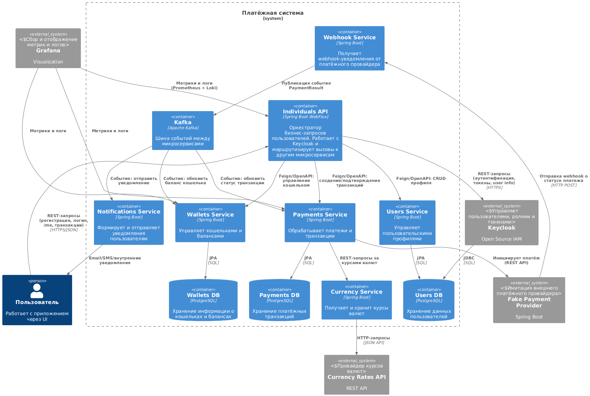

# Payment system
Система представляет собой учебную микросервисную архитектуру платёжной платформы. Её задача — эмулировать ключевые процессы финтех-экосистемы: регистрацию пользователей, управление кошельками, проведение платёжных операций, взаимодействие с внешним провайдером и обмен валют, а также централизованную доставку уведомлений.
В системе реализованы как синхронные REST-интеграции, так и событийное взаимодействие через Kafka, что позволяет отработать реальные паттерны проектирования микросервисов: оркестрация, интеграция, асинхронная обработка и компенсирующие действия.

## Архитектура проекта

## Обзор микросервисов

- **[Individuals API](./individuals-api)**:  
  *Тип: Оркестратор  
  Роль: Единая точка входа для внешнего клиента  
  Описание: Сервис реализует внешние REST API для регистрации, логина, обновления токена и получения информации о пользователе. Все операции проходят через Individuals API, включая маршрутизацию бизнес-запросов к доменным сервисам. Он работает напрямую с Keycloak по Admin и Token API и не имеет собственной БД.*
- **Keycloak**:  
  *Тип: Внешний компонент (IAM).  
  Роль: Централизованная аутентификация и управление пользователями  
  Описание: Используется для хранения учётных данных, управления ролями, выдачи и валидации JWT-токенов. Individuals API взаимодействует с ним напрямую.*
- **[Users Service](./person-service)**:  
  *Тип: Доменный сервис  
  Роль: Управление пользовательскими профилями  
  Описание: После регистрации пользователя в Keycloak, его бизнес-профиль создаётся и управляется через Users Service. Сервис хранит расширенные пользовательские данные (имя, страна, адрес и т.д.) и предоставляет REST-интерфейс (доступен только через Individuals API).*
- **Wallets Service**:  
  *Тип: Доменный сервис  
  Роль: Управление кошельками и балансами  
  Описание: Обслуживает CRUD-операции над кошельками. Поддерживает внутренние переводы между кошельками пользователей, а также изменение баланса в ответ на платёжные события (например, пополнение или списание). Баланс корректируется только при получении событий из Kafka (transaction.completed, transaction.failed), обеспечивая event-driven обработку.*
- **Payment Service**:  
  *Тип: Доменный сервис  
  Роль: Инициация и обработка платёжных транзакций  
  Описание: Обеспечивает создание и подтверждение заявок на пополнение, перевод и вывод. Для deposit/withdrawal формирует запросы к внешнему провайдеру. Работает с:*
    - *Currency Service*
    - *Fake Payment Provider*
    - *Kafka*

  *Не создаёт никаких записей в базе на этапе /init — транзакция появляется в базе только после подтверждения (/confirm).*
- **Currency Service**:   
  *Тип: Утилитарный сервис  
  Роль: Работа с курсами валют  
  Описание: Подключается к внешнему API провайдера валют (например, Open Exchange Rates) и отдаёт актуальные курсы. Используется Payments Service при расчёте комиссий и условий платежей в разных валютах.*

- **Webhook Service**:  
  Тип: Интеграционный сервис  
  Роль: Приём webhook-уведомлений от внешнего провайдера  
  Описание: Принимает асинхронные POST-запросы от Fake Payment Provider о результатах платежей. Публикует события (payment.status.updated) в Kafka, не обрабатывая их напрямую — это делают потребители. Webhook защищён секретным токеном, проверяемым при каждом вызове.

- **Notification Service**:  
  *Тип: Инфраструктурный сервис  
  Роль: Формирование и отправка уведомлений  
  Описание: Подписывается на события из Kafka (например, transaction.completed, user.registered) и отправляет уведомления пользователю — через email, лог, или базу уведомлений. Также предоставляет REST API для просмотра уведомлений пользователем.*

- **Fake Payment Provider**:  
  *Тип: Внешний имитируемый сервис  
  Роль: Тестовый платёжный провайдер  
  Описание: Имитирует внешний REST API для проведения платежей. Принимает запросы на deposit/withdrawal и позже отправляет webhook с результатом (успех или ошибка). Позволяет тестировать все сценарии интеграции без реальных платёжных шлюзов.*
