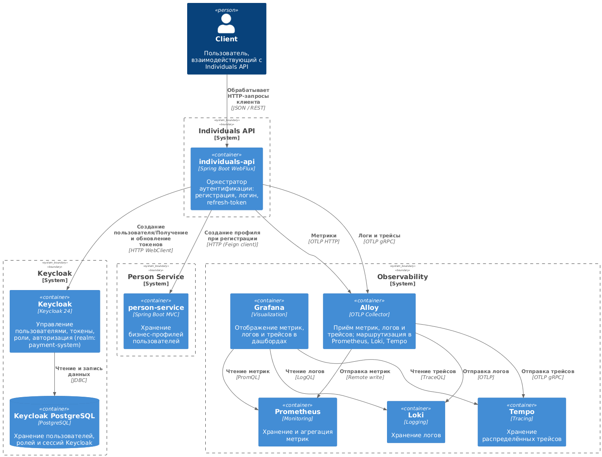
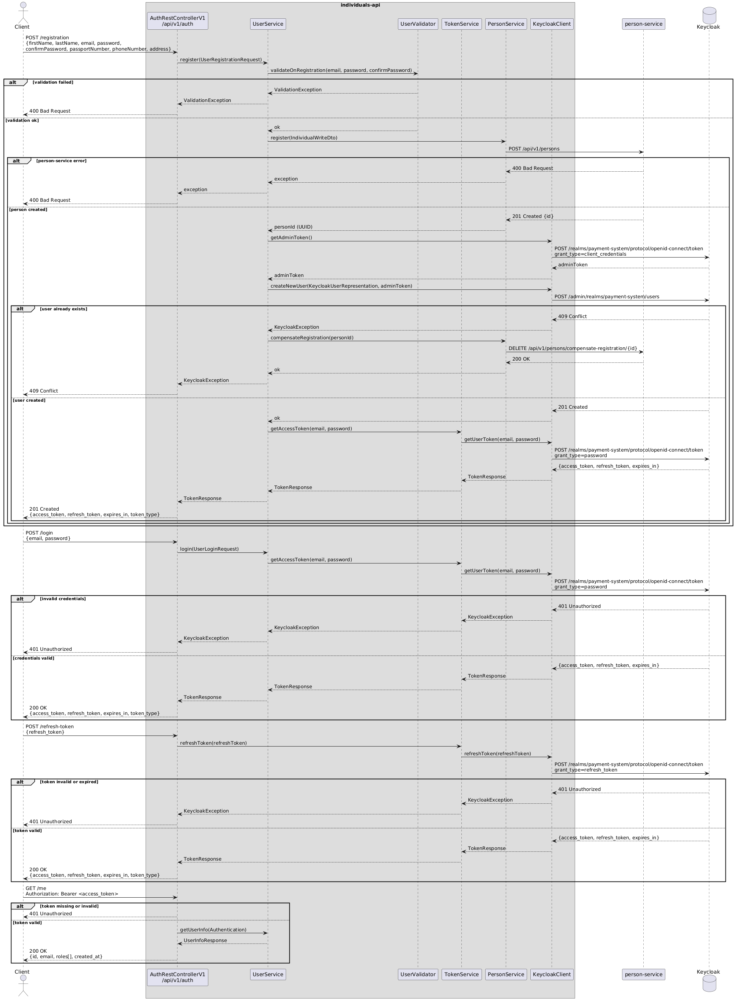

# Описание
**Individuals API** – это микросервис, отвечающий за оркестрацию процессов аутентификации пользователей в системе.

## Стэк:
````
- Java 25
- Spring Boot 4.0.2
- Spring WebFlux
- Spring Security
- Spring Boot Actuator
- Gradle (Groovy DSL)
- Keycloak 24
- Prometheus
- Micrometer
- Logback (JSON формат)
- Loki
- OpenAPI 3.0 (в формате YAML)
- OpenAPI Generator Plugin (для Gradle)
- JUnit 5
- Mockito
- Testcontainers
- Docker
- Docker Compose
- Grafana
````

## Архитектура системы


## Внутренняя архитектура сервиса


## Диаграмма последовательности


## Запуск
````
docker compose up -d
````

## Документация
- OpenAPI: `openapi/individuals.api.yaml`
