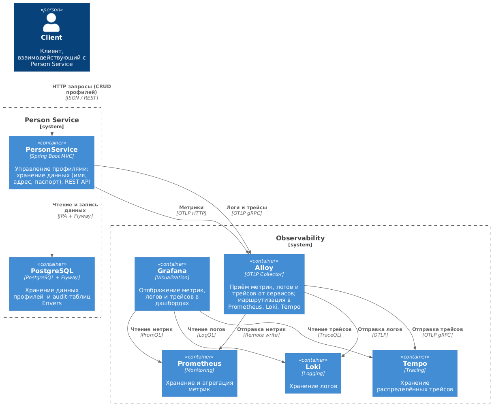
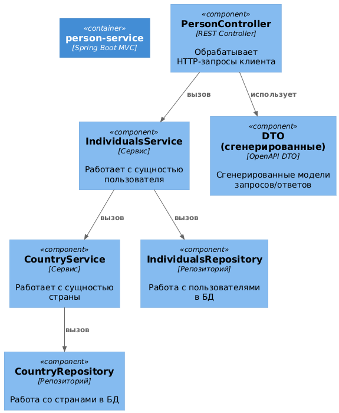

# Описание
**Person Service** – сервис хранит расширенные пользовательские данные (имя, страна, адрес и т.д.) и предоставляет REST-интерфейс (доступен только через Individuals API).

## Стэк:
````
- Java 25
- Spring Boot 4.0.2
- Spring MVC
- Spring Boot Actuator
- Gradle (Groovy DSL)
- Micrometer
- Logback (JSON формат)
- Prometheus
- Tempo
- Alloy
- Loki
- OpenAPI 3.0 (в формате YAML)
- OpenAPI Generator Plugin (для Gradle)
- JUnit 5
- Mockito
- Testcontainers
- Wiremock
- Docker
- Docker Compose
- Grafana
````

## Архитектура системы


## Внутренняя архитектура сервиса



## Запуск
````
docker compose up -d person-service
````

## Документация
- OpenAPI: `openapi/person-api.yaml`
